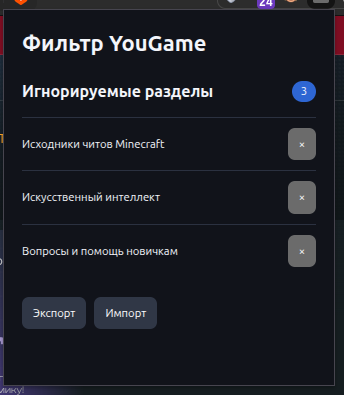

# YouGame Forum Filter

Небольшое расширение для Chrome и Firefox. Добавляет кнопку игнорирования раздела на YouGame и скрывает его темы в лентах.

## How to use

В разделах добавляется кнопка "игнорировать раздел", после нажатия убирает из главного меню (yougame.biz) связанные с игнорируемым разделом треды

## Установка

### Chrome

1. Распакуйте `release/yougame-forum-filter-chrome.zip`.
2. Откройте `chrome://extensions`
3. Включите «Режим разработчика» и выберите «Загрузить распакованное расширение».
4. Укажите распакованную папку.

### Firefox

1. Возьмите `release/yougame-forum-filter-firefox.xpi`.
2. Для локальной проверки откройте `about:debugging#/runtime/this-firefox` → «Загрузить временное дополнение» и выберите файл `.xpi`.
